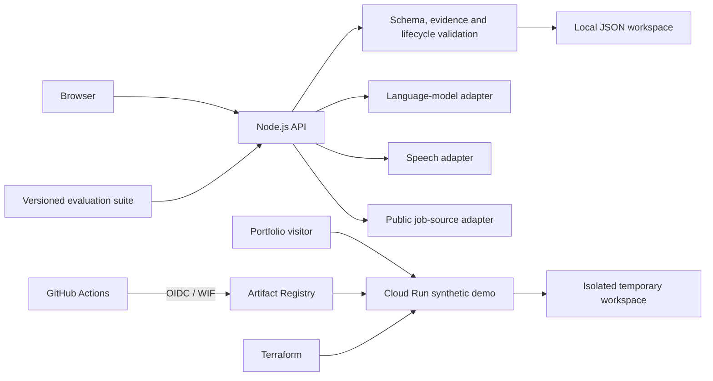

# Engineering case study

## Product problem

The target learner can read technical English but needs deliberate practice turning real software or AI experience into relevant, structured interview answers. Generic question banks do not preserve the job context, and unconstrained model feedback can invent evidence or produce advice that cannot be traced back to the learner's words.

This project treats one complete Practice Loop as the core product unit:

1. select a job-grounded question;
2. answer by text or voice;
3. receive bilingual, transcript-grounded feedback;
4. optionally revise or answer follow-up questions;
5. retain one Focus Point for later practice.

## What I built

- A dependency-free Node.js HTTP application with a browser interface and local JSON workspace.
- Replaceable language-model, speech, and public-job adapters for deterministic, OpenAI, Claude, Codex, and Greenhouse-backed workflows.
- Structured feedback contracts with four independent dimensions, exact transcript quotations, bilingual-pair validation, and evidence boundaries.
- Durable operation states with request fingerprints, cancellation, timeout handling, retry safety, and protection against late writes.
- Text and voice Practice Loops, optional follow-ups, short mock sessions, revision comparison, Practice Records, and recurring Focus Points.
- A versioned evaluation pipeline with synthetic fixtures, three-repeat stability checks, bilingual review artifacts, frozen inputs, and explicit release gates.
- An isolated public Cloud Run demo deployed through Docker, Terraform, GitHub Actions, and keyless Google Cloud Workload Identity Federation.

The implementation entry points are [`src/server.js`](src/server.js), [`src/model-contracts.js`](src/model-contracts.js), [`public/app.js`](public/app.js), and [`evaluation/README.md`](evaluation/README.md).

## Architecture and trust boundaries



The private and public paths intentionally have different boundaries:

| Local Workspace | Public Demo Workspace |
| --- | --- |
| Runs on loopback and stores the learner's selected data locally. | Runs on Cloud Run with deterministic providers and synthetic seed data. |
| External providers are opt-in and credentials remain server-side environment variables. | Ignores provider-selection credentials and never calls a paid AI or speech provider. |
| Persists until the learner deletes the workspace. | Uses an anonymous, isolated workspace that expires after one idle hour and may disappear when the instance stops. |

There are no hosted accounts, durable multi-user database, or claim that an anonymous demo cookie is authentication. A future real-provider deployment is a separate, access-restricted Hosted AI Beta decision.

## Why the feedback is structured

Free-form feedback is easy to generate and difficult to trust. The application therefore validates model output before it reaches the workspace:

- questions must link back to quoted job evidence;
- feedback must keep relevance, support, structure, and English expression separate;
- every finding must quote one contiguous substring from the submitted transcript;
- English and Traditional Chinese fields share the same rating and evidence;
- generated assistance cannot silently become the learner's Answer Attempt;
- unverified resume claims cannot be promoted into approved evidence.

Invalid output is rejected instead of partially saved. This makes retries and regressions observable, but it does not prove that every semantically valid response is good coaching.

## Verification strategy

The repository separates engineering correctness from model-quality claims:

| Layer | Evidence |
| --- | --- |
| Domain and API | `npm test` covers schemas, citations, persistence, deletion, quotas, retries, cancellation, and deployment contracts. |
| Browser workflow | `npm run test:browser` drives complete desktop and mobile Practice Loops in a real browser. |
| Evaluation pipeline | `npm run evaluate` runs versioned synthetic cases and checks structure, exact evidence, bilingual fields, and repeat stability. |
| Supply chain | CI scans Git history for secrets, lints workflows and Docker, scans the image, smoke-tests the container, and validates Terraform. |
| Deployment | The production workflow builds an immutable image, deploys through Terraform, checks `/api/health`, and can return traffic to the previous revision. |

The latest saved Codex evidence (contract 3.3) passes the automatic constraints for all 60 outputs and the three-repeat stability gate for 80 of 80 case/dimension units. The v1.0 quality gate nevertheless remains **blocked** for two reasons: only **20 of 60** outputs fall within every approved rating range, and the independent AI bilingual review found one case whose English and Traditional Chinese feedback disagree in meaning. Earlier contracts were also blocked on label comparison (3.0: 52 of 60; 3.2: 25 of 60). Labels were drafted separately for each version, and from 3.2 onward they were approved before the feedback run, so these counts are not directly comparable. The public project is consequently labelled v0.9 and makes no live-model teaching-quality claim. The machine-readable evidence is retained in [`evaluation/results/codex-v3-3-reviewed.json`](evaluation/results/codex-v3-3-reviewed.json).

## Delivery path

```text
pull request
    ↓
GitHub Actions checks (required-checks must pass)
    ↓
squash merge to main
    ↓
checks on main
    ↓
production approval
    ↓
OIDC / Workload Identity Federation
    ↓
Artifact Registry image
    ↓
Terraform updates Cloud Run
    ↓
live health smoke test
```

GitHub stores the code and runs CI/CD; Google Cloud executes and observes the public service. No long-lived Google Cloud service-account key is stored in GitHub. Deployment details and the bootstrap boundary are documented in [`infra/README.md`](infra/README.md).

## Deliberate limitations

- The public demo uses fixed providers; its scores demonstrate interaction design, not coaching quality.
- The current application assumes one trusted local account and one server process per Local Workspace.
- Real speech, learning outcomes, fairness, and human comprehension have not been validated.
- Exact citations establish traceability, not complete semantic truth or resistance to every prompt-injection attempt.
- Budget notifications alert the owner but do not impose an external-provider spending cap.

These constraints are kept visible because the project is intended to demonstrate product judgement and verification discipline, not to present an experiment as a finished SaaS product.
