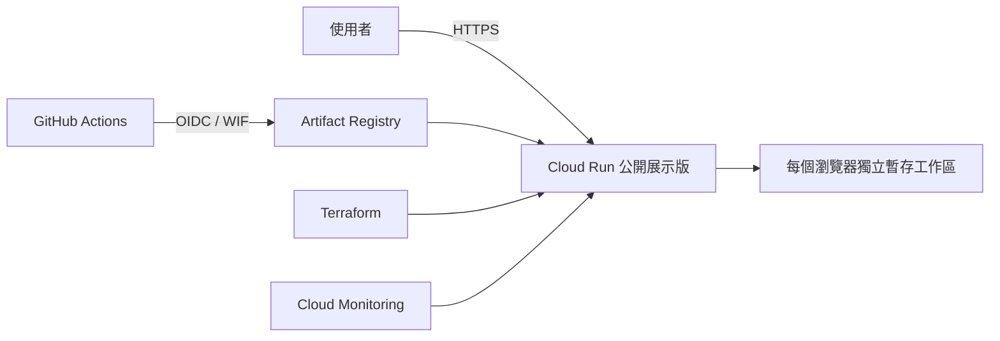

# 英文面試練習教練

這是一個為台灣科技職缺設計的英文面試練習工具。使用者可以貼上職缺說明與履歷，建立符合職缺需求的面試題目，完成文字或語音回答，取得中文回饋，修改答案並追蹤反覆出現的改善重點。

專案採取本機優先設計。個人履歷、回答、錄音與練習紀錄預設只保存在使用者電腦，不需要註冊帳號或建立雲端資料庫。

## 主要功能

- 根據職缺說明建立英文面試題組
- 選擇性搭配履歷，保留每次練習使用的版本
- 支援文字回答、語音轉錄與錄音回放
- 提供中文回饋、英文示範與重點句修正
- 支援面試官追問與同題第二次回答
- 從完成的練習整理改善重點與進度
- 提供三題連續作答的短模擬面試
- 可從設定的公開職缺來源搜尋並篩選職缺
- 所有模型輸出都會經過結構、引用與資料邊界驗證

## 專案狀態

目前公開版本定位為 **v0.9 合成資料展示版**，用來展示完整練習流程、資料隔離與部署架構。

公開展示版固定使用示範服務，不會呼叫付費語言模型或語音服務。固定產生的題目與評分只用來展示操作流程，不代表真實的面試教學品質。正式模型品質與真人使用驗證仍在進行中。

## 本機執行

需求：Node.js 22 或更新版本。

```bash
npm start
```

開啟：<http://127.0.0.1:4310>

預設會使用固定回應的示範服務，不需要帳號、API key 或雲端服務。

本機資料儲存在 `.workspace/`：

- `workspace.json`：職缺、題目、回答、回饋與進度
- `recordings/`：已提交語音回答的錄音

`.workspace/` 已被 Git 忽略。請勿將真實履歷、回答、錄音或模型服務憑證加入版本控制。

## 使用外部模型

使用自己的 OpenAI API key：

```bash
OPENAI_API_KEY=your-key \
COACH_LANGUAGE_PROVIDER=openai \
COACH_SPEECH_PROVIDER=openai \
npm start
```

只使用 Claude 處理文字回饋：

```bash
ANTHROPIC_API_KEY=your-key \
COACH_LANGUAGE_PROVIDER=claude \
npm start
```

API key 只從執行程序的環境變數讀取，不會寫入工作區或傳到瀏覽器。外部模型呼叫可能產生費用，職缺、回答或音訊也會依所選服務傳送到外部系統。

## 自動測試

```bash
# API、資料模型、安全邊界與部署設定回歸測試
npm test

# 使用固定資料執行離線評估
npm run evaluate

# 使用真實瀏覽器完成一輪隔離的操作測試
npm run test:browser
```

GitHub Actions 的 `checks.yml` 會在 Pull Request 與推送到 `main` 時執行：

- Git 歷史機密掃描與 workflow 語法檢查
- Node.js 回歸測試與離線評估
- Dockerfile lint、image 弱點掃描與容器 smoke test
- Terraform 格式與設定驗證

## 公開 Cloud Run 展示版

Cloud Run 版本與本機工作區完全分離：

- 每個瀏覽器取得獨立的暫存工作區
- 只載入合成示範資料
- 工作區閒置一小時後失效
- Cloud Run instance 停止後資料會消失
- 不會載入本機 `.workspace`、API key 或真實履歷
- 每個執行個體最多服務 50 個暫存工作區
- Cloud Run 最少 0、最多 1 個執行個體

請勿在公開展示版輸入真實履歷、個人資料或機密內容。



## 部署流程

第一次部署前，需要安裝並登入：

- Google Cloud CLI
- Terraform
- GitHub CLI
- Docker

接著執行：

```bash
./scripts/setup-gcp.sh
```

設定精靈會建立必要的 GCP bootstrap 資源、設定 GitHub Actions variables，並引導設定 `production` environment 的人工核准。

日後推送到 `main` 的流程：

```text
checks.yml 執行測試與安全檢查
          ↓
deploy.yml 等待 production 人工核准
          ↓
建置 Docker 映像
          ↓
推送 Artifact Registry
          ↓
Terraform 更新 Cloud Run
          ↓
正式網址 /api/health 冒煙測試
```

部署失敗且已有舊版修訂版本時，workflow 會把流量切回上一個可用版本。Terraform 與手動部署指令整理在 [`infra/README.md`](infra/README.md)。

## Docker 本機檢查

```bash
docker build -t interview-coach:demo .
docker run --rm -p 8080:8080 interview-coach:demo
```

開啟：<http://127.0.0.1:8080>

健康檢查：<http://127.0.0.1:8080/api/health>

## 目錄結構

| 路徑 | 用途 |
| --- | --- |
| `src/` | HTTP API、領域邏輯、模型服務與資料儲存 |
| `public/` | 瀏覽器介面與靜態資源 |
| `test/` | Node.js 回歸測試與瀏覽器冒煙測試 |
| `evaluation/` | 固定測試資料與離線模型評估 |
| `demo/` | 公開 Demo 使用的合成 seed |
| `infra/` | GCP bootstrap 與 Cloud Run Terraform |
| `.github/workflows/` | CI 與 production 部署流程 |
| `scripts/` | 本機啟動、驗證與 GCP 設定工具 |

## 資料與隱私界線

- 本機模式只監聽 `127.0.0.1`。
- 公開模式使用獨立的展示閘道與暫存資料。
- 錄音檔不會存入 JSON，也不會自動上傳。
- 只有使用者主動設定外部模型服務時，對應資料才會送往該服務。
- 預算通知只負責提醒，不會自動停止 GCP 資源或限制費用。

這個 repository 展示的是可驗證的產品流程、隱私邊界與部署工程；目前仍屬於展示／實驗版本。
