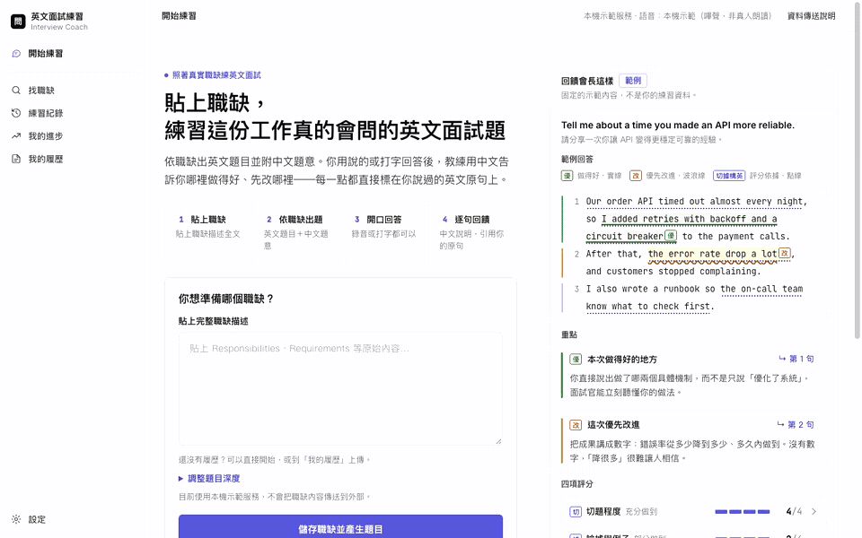
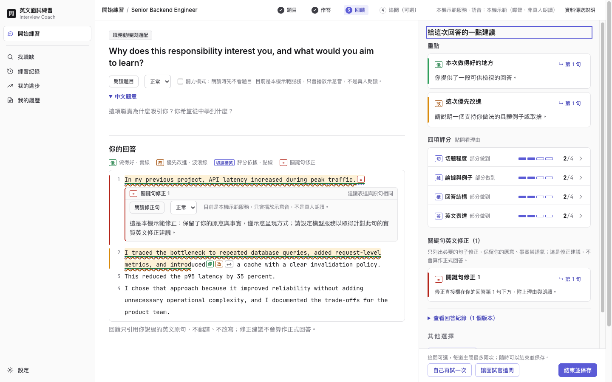
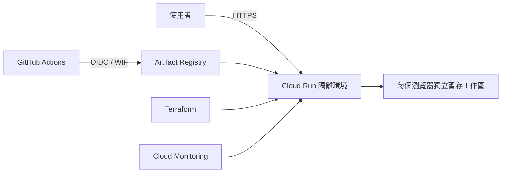

# 英文面試練習教練

Adaptive English Interview Coach

[](https://github.com/iamshiehpay/english-interview-practice/actions/workflows/checks.yml)

[Live Demo](https://adaptive-english-interview-coach-h72bil37kq-de.a.run.app) · [Engineering Case Study](PORTFOLIO.md)

這是一套英文面試練習工具，協助軟體與 AI 求職者從回答、逐句回饋到重點複習，完成一套可追蹤的練習流程。

## 本機操作流程



_14 秒操作錄影：使用一次性本機工作區與固定示範服務，不含 API key、真實履歷或個人資料。_

## 完成練習後的回饋



_本機固定資料畫面：完成練習後，可對照逐字稿、中文回饋、英文示範與下一步練習重點。_

## 專案總覽

| 項目 | 說明 |
| --- | --- |
| **要解決的問題** | 技術求職者即使能閱讀英文，仍需要針對特定職缺練習如何清楚表達經驗、推理與取捨。 |
| **核心流程** | 匯入職缺與履歷 → 產生題目 → 文字或語音回答 → 取得引用原句的雙語回饋 → 修改答案、回答追問並保留下一個練習重點。 |
| **延伸功能** | 三題短模擬面試、練習紀錄、重複改善重點追蹤，以及公開職缺搜尋與篩選。 |
| **隱私設計** | 履歷、回答、錄音與練習紀錄預設只存在使用者電腦，不需要帳號或雲端資料庫。 |
| **系統架構** | 無框架的 Node.js 應用程式，語言模型、語音與職缺來源都可替換；所有模型輸出都會經過結構、引用與資料邊界驗證。 |
| **驗證方式** | API 與領域回歸測試、真實瀏覽器冒煙測試、版本化離線評估、容器掃描與 Terraform 驗證。 |
| **部署實作** | GitHub Actions 透過無金鑰的 Workload Identity Federation，將隔離的合成資料環境部署到 Cloud Run。 |

更完整的產品取捨、信任邊界與驗證結果整理在 [`PORTFOLIO.md`](PORTFOLIO.md)；該文件是供招募者與技術面試官深入閱讀的英文工程案例說明。

## 專案狀態

目前專案定位為 **v0.9 作品集版本**，用來展示完整練習流程、資料隔離、評估方法與部署架構。

預設模式固定使用示範服務，不會呼叫付費語言模型或語音服務。固定產生的題目與評分只用來驗證操作流程，不代表真實的面試教學品質。正式模型品質與真人使用驗證仍在進行中。

## 本機執行

需求：Node.js 22 或更新版本。

```bash
npm start
```

開啟：<http://127.0.0.1:4310>

預設會使用固定回應的示範服務，不需要帳號、API key 或雲端服務。

本機資料儲存在 `.workspace/`：

- `workspace.json`：職缺、題目、回答、回饋與進度
- `recordings/`：已提交語音回答的錄音

`.workspace/` 已被 Git 忽略。請勿將真實履歷、回答、錄音或模型服務憑證加入版本控制。

## 使用外部模型

使用自己的 OpenAI API key：

```bash
OPENAI_API_KEY=your-key \
COACH_LANGUAGE_PROVIDER=openai \
COACH_SPEECH_PROVIDER=openai \
npm start
```

只使用 Claude 處理文字回饋：

```bash
ANTHROPIC_API_KEY=your-key \
COACH_LANGUAGE_PROVIDER=claude \
npm start
```

API key 只從執行程序的環境變數讀取，不會寫入工作區或傳到瀏覽器。外部模型呼叫可能產生費用，職缺、回答或音訊也會依所選服務傳送到外部系統。

## 自動測試

```bash
# API、資料模型、安全邊界與部署設定回歸測試
npm test

# 使用固定資料執行離線評估
npm run evaluate

# 使用真實瀏覽器完成一輪隔離的操作測試
npm run test:browser
```

每個合併請求（Pull Request）都會執行 GitHub Actions 的 `checks.yml`。其中，Git 歷史機密掃描與工作流程語法檢查每次都執行；變更影響應用程式、映像、評估、基礎設施、工作流程或測試時，還會執行：

- Node.js 回歸測試與離線評估
- Dockerfile lint、image 弱點掃描與容器 smoke test
- Terraform 格式與設定驗證

最後的 `required-checks` 彙總以上結果，是合併到 `main` 唯一必要的檢查。純 README、CONTEXT、AGENTS 或本機 `docs/` 文件變更會略過較耗時的檢查，也不會觸發 Cloud Run 部署。

## 變更流程

`main` 不接受直接推送，所有變更都透過合併請求：

1. 每個工作項目建立一個分支；需要平行開發時可使用 `git worktree`。
2. 推送分支並建立合併請求，標題使用 Conventional Commits 格式，例如 `feat: Add short mock session`。
3. `required-checks` 通過後以 squash 方式合併，合併請求標題會成為 `main` 上的 commit 訊息。
4. 影響上述路徑的合併會再執行一次 `checks.yml`，通過後在正式環境人工核准下部署到 Cloud Run。

## Cloud Run 隔離環境

Cloud Run 環境用來驗證部署與資料隔離，與本機工作區完全分離：

- 每個瀏覽器取得獨立的暫存工作區
- 只載入合成資料
- 工作區閒置一小時後失效
- Cloud Run 執行個體停止後資料會消失
- 不會載入本機 `.workspace`、API key 或真實履歷
- 每個執行個體最多服務 50 個暫存工作區
- Cloud Run 最少 0、最多 1 個執行個體

請勿在這個雲端環境輸入真實履歷、個人資料或機密內容。



## 部署流程

第一次部署前，需要安裝並登入：

- Google Cloud CLI
- Terraform
- GitHub CLI
- Docker

接著執行：

```bash
./scripts/setup-gcp.sh
```

設定精靈會建立必要的 GCP 初始資源、設定 GitHub Actions 變數，並引導設定正式環境的人工核准。

日後推送到 `main` 的流程：

```text
checks.yml 執行測試與安全檢查
          ↓
deploy.yml 等待正式環境人工核准
          ↓
建置 Docker 映像
          ↓
推送 Artifact Registry
          ↓
Terraform 更新 Cloud Run
          ↓
正式網址 /api/health 冒煙測試
```

部署失敗且已有舊版修訂版本時，工作流程會把流量切回上一個可用版本。Terraform 與手動部署指令整理在 [`infra/README.md`](infra/README.md)。

## Docker 本機檢查

```bash
docker build -t interview-coach:demo .
docker run --rm -p 8080:8080 interview-coach:demo
```

開啟：<http://127.0.0.1:8080>

健康檢查：<http://127.0.0.1:8080/api/health>

## 目錄結構

| 路徑 | 用途 |
| --- | --- |
| `src/` | HTTP API、領域邏輯、模型服務與資料儲存 |
| `public/` | 瀏覽器介面與靜態資源 |
| `test/` | Node.js 回歸測試與瀏覽器冒煙測試 |
| `evaluation/` | 固定測試資料與離線模型評估 |
| `demo/` | Cloud Run 隔離環境使用的合成種子資料 |
| `infra/` | GCP bootstrap 與 Cloud Run Terraform |
| `.github/workflows/` | CI 與正式環境部署流程 |
| `scripts/` | 本機啟動、驗證與 GCP 設定工具 |

## 資料與隱私界線

- 本機模式只監聽 `127.0.0.1`。
- 公開模式使用獨立的展示閘道與暫存資料。
- 錄音檔不會存入 JSON，也不會自動上傳。
- 只有使用者主動設定外部模型服務時，對應資料才會送往該服務。
- 預算通知只負責提醒，不會自動停止 GCP 資源或限制費用。

這個程式碼庫展示的是可驗證的產品流程、隱私邊界與部署工程；目前仍屬於作品集／實驗版本。
