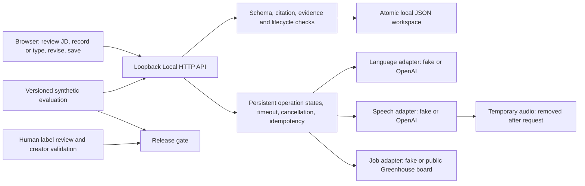

# Architecture and trust boundaries

The browser talks only to the local server. OpenAI receives JD text for analysis, JD plus the existing set for additional questions, and the current question/transcript with relevant approved excerpts for feedback. Speech receives audio only. Greenhouse receives the configured public board token or job ID; search filtering remains local. Credentials are environment variables held by server adapters, excluded from workspace and API descriptors.

The store commits a successful domain result and operation receipt atomically. Retry IDs have input fingerprints. Cancellation, timeout and deletion prevent late local writes; they cannot retract a remote request. Restart marks pending work interrupted, allowing explicit retry. Raw audio is temporary; editable transcripts become durable only when the learner submits them.

Snapshots retain exact JD text. Generated facts require verbatim supporting citations; inferences stay labelled. Questions link capability IDs and evidence. A Practice Record stores two attempts, four separate ratings, exact supporting transcript quotes, comparison and one learner-selected Focus Point. Unverified candidate claims cannot enter approved personalization without explicit approval. Progress groups normalized Focus Points and retains supporting records.

One process per local workspace; no multi-user authentication, shared database or distributed queue. This boundary intentionally keeps the MVP auditable and easy to run.
